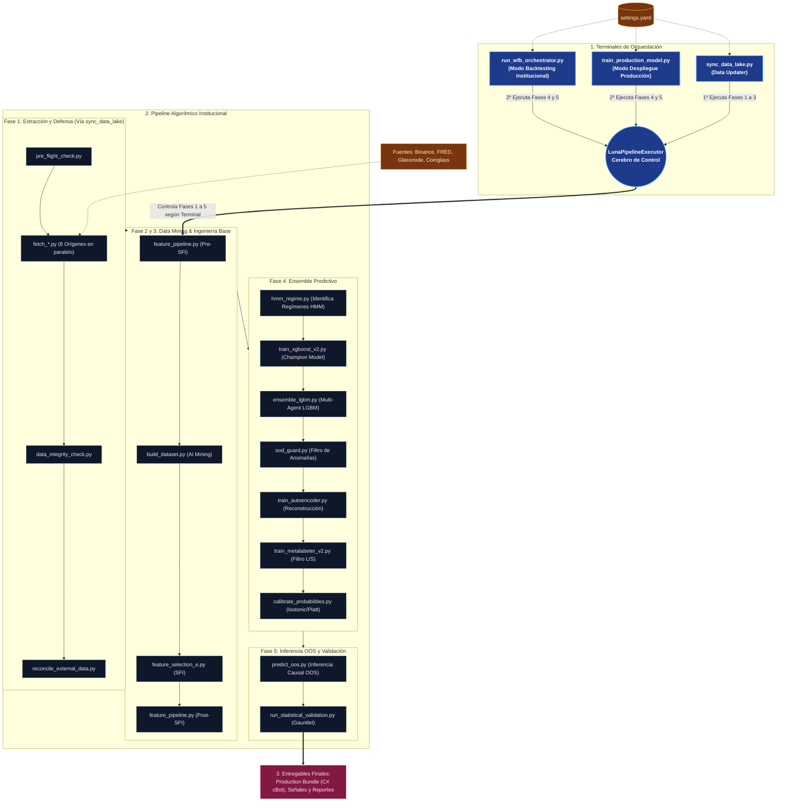

# Arquitectura Institucional de Procesos (Luna V2)

Este documento expone en máxima profundidad la arquitectura modular "End-to-End" de Luna V2. Se detallan las agrupaciones lógicas, los artefactos generados, las defensas institucionales, las tecnologías subyacentes y el ciclo de vida exacto de la información a través de la tubería algorítmica.

## 1. Diagrama de Flujo Principal

El siguiente diagrama detalla la orquestación del sistema, desde la extracción de datos en fuentes externas, pasando por las barreras de seguridad, hasta la generación de los entregables finales para producción y C#.

## 2. Descripción de las Fases del Pipeline

El pipeline se encuentra dividido en una secuencia lógica para mantener el estricto control de datos, modelos y estabilidad institucional.

### Fase 0 y 1: Extracción y Defensa Institucional
Esta es la barrera de seguridad de Luna.
- Los **Fetchers** se ejecutan en paralelo para extraer miles de métricas desde Binance, Coinglass, FRED y plataformas On-chain.
- Los **Validadores Institucionales** (`data_integrity_check.py`, `reconcile_external_data.py` y `pre_flight_check.py`) garantizan que no existan NaNs críticos, gaps temporales o corrupción en las APIs.

### Fase 2 y 3: Data Mining & Ingeniería Base
Se encarga de generar los datasets y extraer la causalidad profunda.
- **Flujo Corregido:** Primero se ejecuta `feature_pipeline.py` para sentar las bases. Luego, el motor `build_dataset.py` (AI Mining) utiliza esa base para extraer las reglas Alpha (Bayesianas) y Tribus K-Means.
- Se cierra con **SFI (Smart Feature Isolation)** para depurar colinealidades severas antes de inyectar `features_train.parquet` a los modelos.

### Fase 4: Ensemble Predictivo
El núcleo de machine learning de Luna V2 representa una arquitectura en cascada:
- **HMM:** Identifica el régimen de mercado general (Bull, Bear, Calm, Crash).
- **XGBoost & LightGBM:** Champion Model direccional e inteligencia de conjunto (Ensemble Multi-Agente).
- **OOD Guard & AutoEncoder:** Descartan inferencias fuera de distribución (Out-of-Distribution) midiendo la anomalía estructural.
- **MetaLabeler:** Filtro final para reducir dramáticamente los falsos positivos en posiciones Long y Short.
- **Calibrador:** Ajusta las probabilidades generadas para reflejar una confianza estadística real (Isotonic / Platt).

### Fase 5 y 6: Inferencia OOS y Validación Final
Ejecuta las pruebas definitivas del conjunto de modelos en datos puros Out-of-Sample (OOS).
- **Gauntlet Estadístico:** Exige reglas institucionales muy estrictas para aprobar el modelo y enviarlo a la siguiente fase (WinRate > 45%, Riesgo/Recompensa > 1.2, Máx. Drawdown < 15%). Genera el Tearsheet final y el `oos_trades.parquet`.

## 3. Características Técnicas de esta Arquitectura

1. **Aislamiento Total por Semilla (Crash Resilience):** El `LunaPipelineExecutor` utiliza la caché (`wfb_cache`) para "hidratar" (cargar) el estado de una ventana temporal, ejecutar los subprocesos de manera confinada y luego "deshidratar" (guardar) los nuevos modelos/datasets.
2. **Dependencias Estrictamente Causales:** Todo el pipeline evita el *Look-Ahead Bias*. Los modelos nunca ven los datos de validación durante su ajuste.
3. **Múltiples Capas de Defensa (Risk Management):** Para que una señal llegue a cTrader (C#), debe haber sobrevivido a la cascada de filtros institucionales y estadísticos.
4. **Validación Institucional Automatizada:** Evaluaciones duras antes de generar el *Production Bundle* garantizan viabilidad matemática en mercado real.

## 4. Referencia de Comandos y Banderas (CLI)

Para interactuar con el pipeline existen tres puntos de entrada principales, separando estrictamente la gestión de datos del modelado:

### A. Para Actualización de Datos (Data Lake y Features)
`python scripts/sync_data_lake.py`
* `--skip-fetch`: Omite la descarga de datos si solo quieres regenerar las features sintéticas con datos cacheados.
* `--skip-sfi`: Salta el subproceso de aislamiento inteligente (SFI). Ahorra de 8 a 12 horas.
* `--skip-mining`: Evita recalcular las reglas bayesianas de AI Mining.

### B. Para Backtesting Institucional (WFB - Walk-Forward)
`python scripts/run_wfb_orchestrator.py`
*(Asume que `sync_data_lake.py` ya fue ejecutado)*
* `--seeds 42 777`: Define las semillas para el ensemble.
* `--resume`: Salta automáticamente las ventanas temporales (W1, W2...) que ya fueron completadas y cacheadas.
* `--force-resume`: Fuerza la reanudación incluso en el primer intento de la primera semilla.
* `--nocache`: Botón de seguridad. Elimina por completo la carpeta `data/wfb_cache/` para asegurar un test desde cero absoluto sin usar datos cacheados.
* `--smoke-test`: Modo ultrarrápido de depuración que inyecta `LUNA_SMOKE_TEST=1` para limitar iteraciones y probar causalidad.

### C. Para Entrenamiento de Producción (Deployment)
`python scripts/train_production_model.py`
*(Automáticamente invoca a `sync_data_lake.py --skip-sfi --skip-mining` por seguridad)*
* `--mode prod`: Usa el dataset completo hasta el día de hoy (evitando el truncamiento de development).
* `--skip-sync`: Omite la actualización automática del Data Lake al inicio del script.
* `--nocache`: Botón de seguridad. Elimina la carpeta `data/models/` para forzar a que todos los modelos se entrenen de forma limpia y desde cero.
* `--skip-hmm`: Omite el re-entrenamiento del régimen oculto de Markov.
* `--skip-validation`: Corta la ejecución antes del Gauntlet Estadístico si solo quieres exportar los binarios puros.
